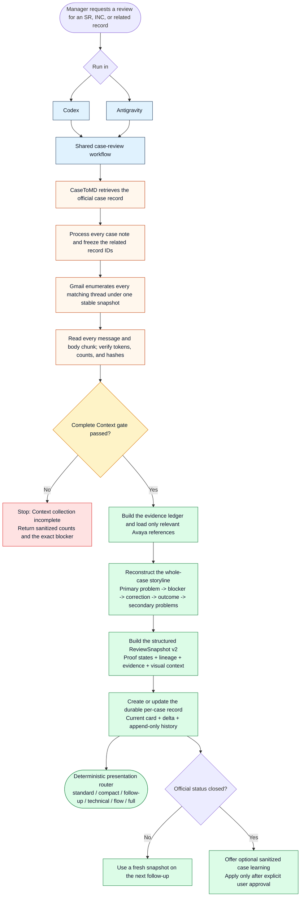

# Avaya Case Review Suite for Support Managers

> **HTML Version Available**: Open **[README.html](README.html)** directly in your browser.

## AI Agent Installation

Use this exact request with an AI agent:

```text
install this plugin: https://github.com/avayahmao/avaya-case-review-pack
```

This repository is a **Codex plugin marketplace, not a standalone skill**. Do
not use a skill installer; the repository root is the plugin selected by its
marketplace manifest. Do not search for a root `SKILL.md` or route this URL to
a skill-only install.

The **v1.10.1 release candidate is not published**. Do not attempt a URL-only
install from a presumed `v1.10.1` tag or run its no-flag installer yet;
**v1.10.0 is the latest published release**. URL-only stable installation
becomes active only after maintainers complete the Gmail cloud attestation,
create the `v1.10.1` tag, and publish the release. At that point the bootstrap
will direct Codex users to `install-codex.ps1` and Antigravity users to
`install.bat`, with the local attestation and live compatibility checks.

## Overview

This package provides an automated **Case Review Suite** for Avaya Support & Operations Managers. It supports **Codex** and **Antigravity** and integrates **CaseToMD**, **Gmail**, and the **Embedded 10-Domain Avaya Debugger Knowledge Base** to produce executive-ready case reviews for Siebel SRs and ServiceNow INCs with evidence-grounded technical direction checks.

---

## How does it work



---

## Evidence-Grounded Review Contract

- Before presentation, the review builds a **structured ReviewSnapshot v2** containing the Case Card, whole-case storyline and problem lineage, fixed Technical Specification, milestones, timeline, evidence register, and evidence-only visual context.
- The deterministic router supports six modes: investigation-complete **standard** for a first or unchanged plain review, investigation-complete **follow-up** with delta first when evidence materially changes, explicit-only **compact**, **technical** for the fixed proof-state Technical Specification, **flow** for the investigation chronology, and explicit **full** output.
- Default chat output preserves the Case Card, Investigation Progress flow, Causal Assessment, six key Technical Specification fields, substantive Timeline, complete dynamic Evidence Register, and one optional secondary diagnostic visual.
- A repeated review becomes follow-up mode only when state, ownership, or evidence materially changes; otherwise it remains the complete standard view without a delta block.
- Technical Specification distinguishes `NOT OBSERVED`, `NOT COLLECTED`, `UNKNOWN`, and `NOT APPLICABLE`; it never uses numeric confidence percentages.
- The Investigation Progress flow is always present in standard/follow-up and is limited to seven nodes; arrows show chronology, not causal proof. The router may add one secondary event comparison, claim-evidence matrix, component swimlane, or ownership checkpoint.
- Explicit full mode renders the structured Case Card, problem lineage, Technical Specification, timeline, and **Appendix A - Evidence Register**. The Evidence Register remains last and its Supports field reverse-maps evidence to exact structured conclusions.
- `case_record.py present --markdown-only` writes canonical `chat-output.md` and `chat-output.sha256`; `verify-final` blocks completion if the proposed final response differs beyond line-ending or final-newline transport normalization.
- All dated milestones, timeline rows, and evidence rows are ordered oldest to newest; undated entries follow dated entries.
- Any rendered list or table containing dates or timestamps is ordered oldest to newest; undated entries follow dated entries.
- The agent answers only what case-specific evidence supports. With zero verifiable case evidence, it outputs exactly `unknown`.
- **Case record freshness** and **Last substantive progress age** are reported separately; Closed/Resolved records are not stale solely because they are old.
- Mitigation maturity is one of Proposed, Lab Validated, Production Deployed, Production Outcome Confirmed, or None Active.
- Risk and action judgments remain with the Manager. Ownership fields only restate commitments already present in evidence.
- Every successful review creates or updates one durable record for the normalized primary Case ID. A follow-up still recollects a new complete CaseToMD/Gmail snapshot; the prior record is used only after analysis to compute what changed.
- The durable record retains ReviewSnapshot v2, the current Case Card, computed delta, decisive evidence digest, and append-only compact history. Detailed views are generated on demand from the structured snapshot.
- Incomplete collection never changes the stored record. Official closure remains separate from RCA state and customer-confirmed production outcome.
- A closed record exposes an optional learning workflow. Learning is sanitized, evidence-strength labeled, drafted only on request, applied only after explicit approval, and stored in a persistent local domain overlay that remains guidance rather than case proof.

**Complete Context Before Analysis** uses the Advanced Gmail Service cloud bridge to process every Case note, query Gmail using the primary raw Case ID only, and process every message in every primary-ID-matched Gmail thread under one stable snapshot. Note-derived related IDs remain available for Case analysis but do not trigger Gmail queries; attachment bodies are excluded. If any source, page-token, cursor, count, hash, manifest, or snapshot check fails, the only result is `Context collection incomplete` with sanitized coverage counts and the blocker. `gmail_search`, `gmail_read`, and `gmail_send` remain backward-compatible APIs, but search and read cannot satisfy this exhaustive gate.

---

## Antigravity Quick Setup (1-Click)

**Recommended (works under corporate Group Policy):**
1. Unzip the pack.
2. **Double-click `install.bat`** (or from a terminal: `.\install.bat`).
3. The installer deploys the single Managed Edge broker and checks authentication. If its status exits `10`, run `python %USERPROFILE%\.gemini\tools\gmail\gmail_brokerctl.py login` and complete SSO/MFA in the opened Edge window.
4. Restart **Antigravity**.

`install.bat` is a thin wrapper that runs `powershell -NoProfile -ExecutionPolicy Bypass -File .\setup_env.ps1`, which is required because Windows PowerShell's default execution policy (`Restricted` / `AllSigned`) blocks unsigned `.ps1` files *before* any code inside the script can adjust the policy.

**Manual (if you prefer to invoke PowerShell yourself):**
```powershell
cd Path\To\avaya-case-review-pack
powershell -NoProfile -ExecutionPolicy Bypass -File .\setup_env.ps1
```

### Behind a corporate SSL-inspecting proxy?

The installer automatically works around common corporate SSL inspection (Zscaler / Netskope / Blue Coat) for:
- **pip** - via `--trusted-host pypi.org files.pythonhosted.org ...`
- **Playwright Chromium download** - via `NODE_TLS_REJECT_UNAUTHORIZED=0`, applied only to that single command and restored immediately afterwards.

If your org supplies a corporate CA bundle, prefer setting `NODE_EXTRA_CA_CERTS` to the `.pem` path *before* running `install.bat`:
```powershell
$env:NODE_EXTRA_CA_CERTS = "C:\path\to\corp-ca-bundle.pem"
.\install.bat
```
When that variable is set, the installer uses your CA bundle instead of the bypass. Chromium remains installed for the explicit one-release `legacy_playwright` rollback; normal Gmail traffic uses the Edge broker.

### Gmail broker operations

The broker owns one dedicated Edge context and serializes requests from all Gmail MCP processes. Use `status`, `diagnostics`, `start`, `login`, and `stop` from `gmail_brokerctl.py`; see [`docs/GMAIL_EDGE_BROKER.md`](docs/GMAIL_EDGE_BROKER.md). The rollback switch is explicit (`GMAIL_BACKEND=legacy_playwright`) and there is no automatic fallback. The local installer deploys the Python broker modules; the Gmail cloud source remains release-maintained and is never deployed by an end-user installer.

---

## Complete Documentation Suite (`docs/`)

All project documentation, release notes, installation guides, design specifications, and presentation decks are organized in the **[`docs/`](docs/)** directory:

- **Release Notes & Version Track**:
  - **[docs/RELEASE_NOTES.html](docs/RELEASE_NOTES.html)** / **[docs/RELEASE_NOTES.md](docs/RELEASE_NOTES.md)** - v1.10.0 - latest published release; v1.10.1 release preparation
- **Executive Presentation**:
  - **[docs/PRESENTATION.html](docs/PRESENTATION.html)** - Interactive Browser Slide Deck
  - **[docs/Avaya_Case_Review_Suite_Presentation.pptx](docs/Avaya_Case_Review_Suite_Presentation.pptx)** - PowerPoint Presentation Deck
- **Technical Architecture & Design**:
  - **[docs/TECHNICAL_DESIGN_DOCUMENT.html](docs/TECHNICAL_DESIGN_DOCUMENT.html)** / **[docs/TECHNICAL_DESIGN_DOCUMENT.md](docs/TECHNICAL_DESIGN_DOCUMENT.md)** - Complete Technical Design Document (TDD)
- **Manager Onboarding & Operational Usage**:
  - **[docs/MANAGER_ONBOARDING_GUIDE.html](docs/MANAGER_ONBOARDING_GUIDE.html)** / **[docs/MANAGER_ONBOARDING_GUIDE.md](docs/MANAGER_ONBOARDING_GUIDE.md)** - Support Manager Setup & Usage Guide
- **Desktop App Installation**:
  - **[docs/ANTIGRAVITY_INSTALLATION_GUIDE.html](docs/ANTIGRAVITY_INSTALLATION_GUIDE.html)** / **[docs/ANTIGRAVITY_INSTALLATION_GUIDE.md](docs/ANTIGRAVITY_INSTALLATION_GUIDE.md)** - Antigravity App Installation & Login Guide

---

## Package Structure

- **`setup_env.ps1`**: Automated environment installer script.
- **`install-codex.ps1`**: Codex marketplace, plugin, dependency, attestation, live-compatibility, and Gmail login installer.
- **`INSTALL.md`**: Agent-readable GitHub URL installation contract for Codex and Antigravity.
- **`.codex-plugin/plugin.json` / `.agents/plugins/marketplace.json` / `.mcp.json`**: Codex plugin, marketplace, and bundled MCP metadata.
- **`docs/GMAIL_EDGE_BROKER.md`**: Managed Edge broker operation, authentication, diagnostics, and rollback guide.
- **`docs/GMAIL_CLOUD_BRIDGE.md`**: Advanced Gmail Service deployment, verification, sequencing, and rollback runbook.
- **`docs/`**: Centralized documentation suite (Release Notes, Guides, TDD, Presentations, PowerPoint).
- **`plugins/avaya-case-review/`**: The plugin containing investigation-complete `case-review`, monthly `qa`, separate `alarm-audit`, `gmail-capability`, **10 embedded Avaya product domain reference guides**, deterministic presenters/scorers, and durable case records. Records and approved learning overlays are stored outside the plugin under `%LOCALAPPDATA%\AvayaCaseReview` so upgrades do not erase them.
- **`tools/casetomd/`**: Python bridge for the CaseToMD server (`https://192.168.67.160:8000/mcp`).
- **`tools/gmail/`**: Advanced Gmail Service cloud source, Single Managed Edge broker, thin Gmail MCP adapter, and explicit legacy Playwright rollback backend. `setup_env.ps1` deploys only the local Python modules.
- **`examples/optional-appsscript/`**: Optional, manually deployed Google Apps Script reference for Sheets/Docs/Email digest governance. It is not installed or invoked by the active runtime.
